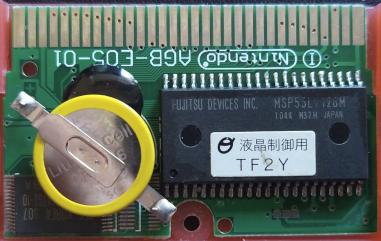

# Nintendo DS Game Boy Advance Bootleg Flasher

## What?
Nintendo DS Game Boy Advance Bootleg Flasher (nds-gbabf) is tool to re-flash some Game Boy Advance chinese bootleg cartridges.

## Why?
Currently, off the shelf flash cartridges for the Nintendo Game Boy Advance are fairly expensive. 
Furthermore, to program these devices, it is also required a cartridge programmer. This approach is user friendly but does require some monetary investment, extra software and world-wide shipping.

As an alternative, this project offers a more affordable and convenient way of using some chinese bootlegs as flash cartridges, taking advantage of their high availability and how easy it is to run homebrew solutions on the Nintendo DS and Nintendo DS Lite.

## How to use?
To use this solution, it is required to own the following devices:
* Nintendo DS/ DS Lite;
* Nintendo DS flash cartridge of your choice (Acekard, R4, etc...);
* Game Boy Advance bootleg cartridge;

Then it should be easy to use, really:

0. (Optional) Save-path* the Game Boy Advance ROM;
1. Upload the program into the Nintendo DS flash cartridge and insert on *slot-1*;
2. Insert Game Boy Advance cartridge on *slot-2*;
3. Boot the console and start the program;
4. On the bottom screen, select the file you want to flash;
5. The program should now start to erase the ROM on *slot-2* cartridge;
6. After that, it should start to write the new ROM on *slot-2* cartridge;
7. When it is done, press start to power off the console.

The new ROM should now be flashed onto Game Boy Advance cartridge.

>***Note:** some Game Boy Advance chinese bootlegs only support SRAM saves. You need to make sure that your ROM is patched accordingly. It is easy but you may want to check this [article](https://flashcartdb.com/index.php/How_to_Patch_GBA_Games_with_GBATA) on how to do so.

## How to build this?
You are free to change and build this tool for your self. Here are some guidelines of how to accomplish this.

It is required to install the following tools
* [devkitPro](https://devkitpro.org/wiki/Getting_Started) (nds-dev specifically)

Then generate the .nds file by running
  ```sh
  $ cd nds-gbabf
  $ make
  ```

## What cartridges are currently supported?
Currently, this is the only supported because this is the only bootleg I own. However, it is certainly possible to add support for more cartridges, specially if they are considered usable by this [table](https://flashcartdb.com/index.php/Main_Page).

Feel free to test this code with other flash carts, at your own risk.

- #### [MSP55LV128](https://flashcartdb.com/index.php/MSP55LV128_AGB-E05-01)
- #### [MSP55LV128M](https://flashcartdb.com/index.php/MSP55LV128M_AGB-E05-01)

<div align="center">
  
</div>

## How to add support for more cartridges?
When programming for the Nintendo DS, you may notice that *libnds* provides a convenient pointer to [GBAROM](https://libnds.devkitpro.org/memory_8h.html#ab537cce395920f11baf640d5d7451fa7). This is a pointer to an array of 16bit words, composing the ROM from *slot-2* cartridge.

In this example we read a word from *slot-2* ROM and then write it back to cartridge.

``` C
uint16_t word = GBAROM[address];
// do some processing;
GBAROM[address] = word;
```

Simple isn't it?
Well, not really.😜
Writing to cartridge is a bit more tricky!

Let me explain.

These flash cartridge store the ROM on a flash memory chip and require to enter programming mode to allow the reprogramming of the chip. This is done by writing a cycle of words in specific addresses of the ROM to issue a command to the chip. As such, in a nutshell, adding support for more cartridges requires understanding how to interact with the flash chip used on the cartridge PCB.

So, what commands do we need?🤔

### **Erase**
First we need to issue an erase command to the sector we want to write.
From an the [datasheet](assets/e520904.pdf), pages 11 and 60, we read that to issue a full memory erase we could use the following 6 word bus cycle.

``` C
GBAROM[0x555] = 0xAA;
GBAROM[0x2AA] = 0x55;
GBAROM[0x555] = 0x80;

GBAROM[0x555] = 0xAA;
GBAROM[0x2AA] = 0x55;
GBAROM[0x555] = 0x10;
```

There's also another example, from the great [cartreader](https://github.com/sanni/cartreader) project by [sanni](https://github.com/sanni/) (it's a great project, consider checking it out!). In [this function](https://github.com/sanni/cartreader/blob/master/Cart_Reader/GBA.ino#L2325), the code is issuing a command to erase a specific sector. Using *libnds* this would translate to.

``` C
GBAROM[0xAAA] = 0xAA;
GBAROM[0x555] = 0x55;
GBAROM[0xAAA] = 0x80;

GBAROM[0xAAA] = 0xAA;
GBAROM[0x555] = 0x55;
GBAROM[sector] = 0x30;
```

>***Note:** there should be a delay in between each write. For the Nintendo DS, placing a ```swiDelay(10)``` after each line works fine.

To verify the erase process, pull the value from flash memory and verify if the 7th bit of returning word is set. This algorithm is described in detail on page 61 of the same [datasheet](assets/e520904.pdf).

The address to read from is dictated by the type of erase being performed. 

For chip erase ```0x0000``` should be pulled. 

For sector erase, the sector address should be used.

``` C
do {
  uint16_t status = GBAROM[sector];
  swiDelay(20);
} while ((status | 0xFF7F) != 0xFFFF);
```

After this condition is verified, the erase is completed.

### **Write**
After the erase process, we can move on and write the data to the chip. 
Just like erasing, writing also requires specific commands to be issued.
From pages 11 and 59 of the same [datasheet](assets/e520904.pdf), we read that to write a single word to flash we could use the following 4 word bus cycle.

``` C
GBAROM[0x555] = 0xAA;
GBAROM[0x2AA] = 0x55;
GBAROM[0x555] = 0xA0;
GBAROM[address] = data;
```

>***Note:** once again, there should be a delay in between each write. ```swiDelay(10)``` works fine.

Just like erasing, to verify the programming process, pull the flash memory value and verify if the 7th bit of returning word is equal to the data 7th bit. This algorithm is described in detail on page 61 of the same [datasheet](assets/e520904.pdf).

``` C
do {
  uint16_t status = GBAROM[address];
  swiDelay(20);
} while ((status | 0xFF7F) != (word | 0xFF7F));
```

After this condition is verified, the programming of that word is completed.

### **Quirks**
In this section we document special cases of specific flash carts.

- Swapped pins

  Some flash carts may present a small variation on the address bus. Indeed, while researching the [MSP55LV128](https://flashcartdb.com/index.php/MSP55LV128_AGB-E05-01) there were various reports that this specific cart has pins 0 and 1 swapped, on the address bus.

  In practice, this means that if we aim to write in a specific address we need to swap these two bits on the address.
  
  For instance, say that we need to write at address ```0xAAAA```, ```1010 1010 1010 1010``` in binary form.
  The program needs to convert this address into ```0110 1010 1010 1010```, which is ```0x6AAA```, and access the memory on that address.

  Maybe this was done by the manufactory to prevent re-writing or as a mistake.

## What's next?
* Make it faster. Investigate buffered / fast programming.
* Implement a nice GUI for a better user experience.
* Implement flash memory identification.
* Add support for save game flashing.
* Add support for more cartridges.

## Research and References

- [Console Technical Info](http://problemkaputt.de/gbatek.htm)
- [FlashCartDB](https://flashcartdb.com/index.php/Main_Page)
- [Common Flash Memory Interface](https://en.wikipedia.org/wiki/Common_Flash_Memory_Interface)
- [cartreader by sanni](https://github.com/sanni/cartreader)
- [GBxCart-RW by insidegadgets](https://github.com/insidegadgets/GBxCart-RW)

